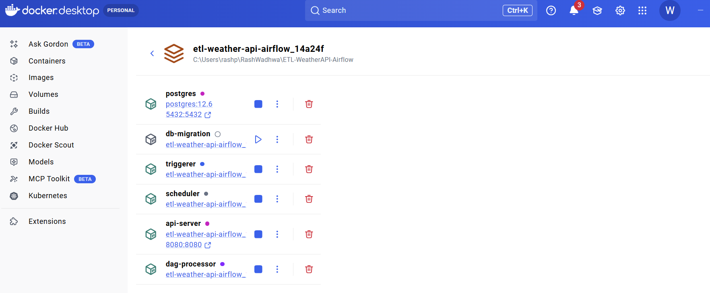
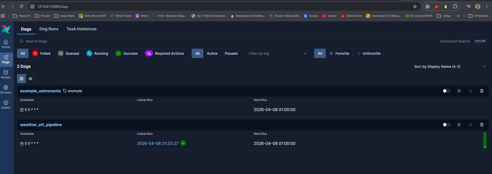
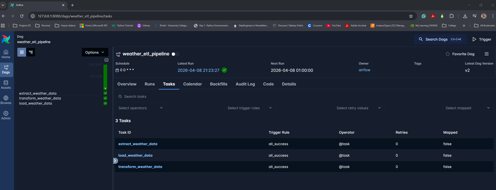
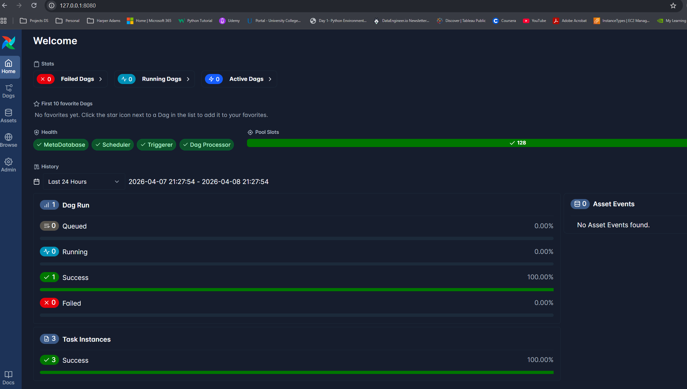
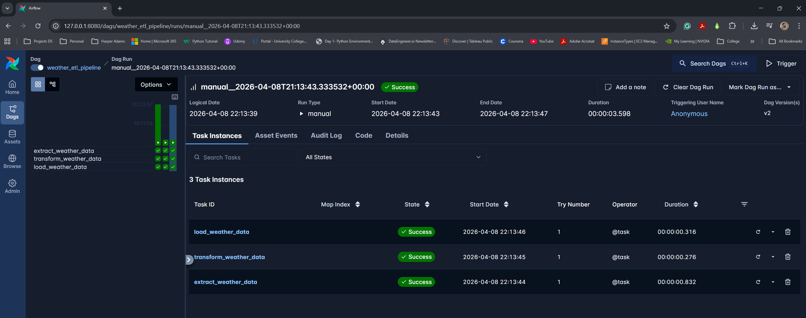
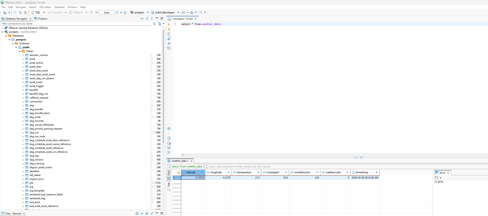
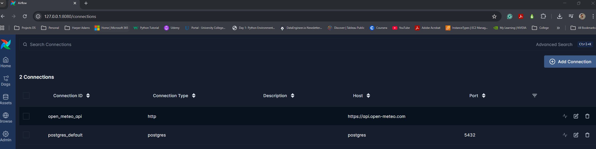
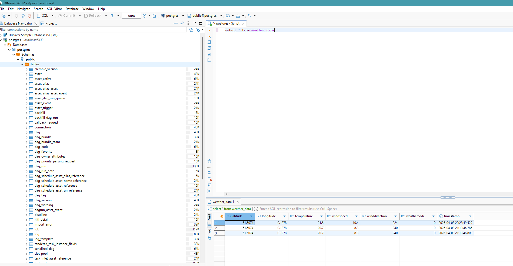

# Weather ETL Pipeline Showcase

Author: RP Wadhwa  
Date: April 8, 2026

## Project Overview
This project demonstrates an end-to-end ETL pipeline using Apache Airflow and Astro CLI.
The pipeline extracts weather data from Open-Meteo, transforms key weather fields, and loads the results into PostgreSQL.
Validation was completed in both Airflow UI and DBeaver.

## Why Apache Airflow (Open Source)
Apache Airflow is an open-source workflow orchestration platform for scheduling, managing, and monitoring data pipelines.
It is useful for:
- Creating repeatable ETL workflows
- Scheduling and automating pipeline runs
- Monitoring task-level execution and failures
- Building production-style data engineering projects locally

## Architecture and Tools
- Orchestration: Apache Airflow (via Astro Runtime)
- Local orchestration environment: Astro CLI + Docker
- Source API: Open-Meteo
- Destination: PostgreSQL
- Query and validation tool: DBeaver

## Step-by-Step Execution Log

### Step 1: Install Astro CLI Command:
winget install -e --id Astronomer.Astro

Note: After installation, restart VS Code before running Astro project commands.

After running `astro dev init`, Astro automatically populates the initial project structure:

```text
ETL-WeatherAPI-Airflow/
├── dags/
├── include/
├── plugins/
├── tests/
│   └── dags/
├── airflow_settings.yaml
├── Dockerfile
├── packages.txt
├── requirements.txt
└── README.md
```

### Step 2: Initialise the Airflow Project Commands:
astro dev init
astro dev start

### Step 3: Verify Airflow Containers in Docker Desktop:
Expected services:
- Postgres
- Scheduler
- DAG Processor
- API Server
- Triggerer



### Step 4: Open Airflow UI and Verify DAG Visibility:
Expected result:
- weather_etl_pipeline is visible in the DAG list

Screenshot:


### Step 5: Trigger the Weather ETL Pipeline:
Expected result:
- Tasks run in order: extract, transform, load
- DAG run completes successfully

Additional run scheduling view:


Screenshot:


### Step 6: Review Task-Level Logs:
Expected result:
- API response fetched from Open-Meteo
- Transformed fields prepared
- Insert statement executed into PostgreSQL

Screenshot:


### Step 7: Validate Loaded Data in PostgreSQL Using DBeaver:
Sample validation query:
SELECT latitude, longitude, temperature, windspeed, winddirection, weathercode, timestamp
FROM weather_data
ORDER BY timestamp DESC;

Expected result:
- New weather records are present in the weather_data table

Screenshot:


## SQL Validation in DBeaver:
Validation checklist:
- weather_data table exists
- Pipeline inserts rows after DAG run
- Weather columns are populated correctly
- Timestamps are generated on insert

Screenshot:


Screenshot:


## Issues Faced and Fixes:
1. Issue: DAG was not appearing in the Airflow UI.
   Fix: Resolved DAG import and dependency issues, then restarted the Astro environment.

2. Issue: Provider-related import errors for HTTP and PostgreSQL hooks.
   Fix: Added required Airflow provider dependencies to project requirements.

3. Issue: Runtime mismatch after dependency changes.
   Fix: Restarted Astro services so containers rebuilt with updated dependencies.

4. Issue: Confusion about API keys.
   Fix: The Open-Meteo endpoint used in this pipeline does not require API keys for the implemented request.

## Achieved Outcomes:
- Built and ran a complete ETL workflow locally
- Orchestrated weather data ingestion and load using Airflow
- Successfully validated final data in PostgreSQL via DBeaver
- Captured full evidence from ingestion to load with screenshots

## Documentation Links:
- Astro CLI installation docs:
  https://www.astronomer.io/docs/astro/cli/install-cli
- Open-Meteo API docs:
  https://open-meteo.com/en/docs?latitude=51.5085&longitude=-0.1257
- DBeaver download page:
  https://dbeaver.io/download/

## Potential future Steps:
- alerts, retries, tests, deployment on AWS
